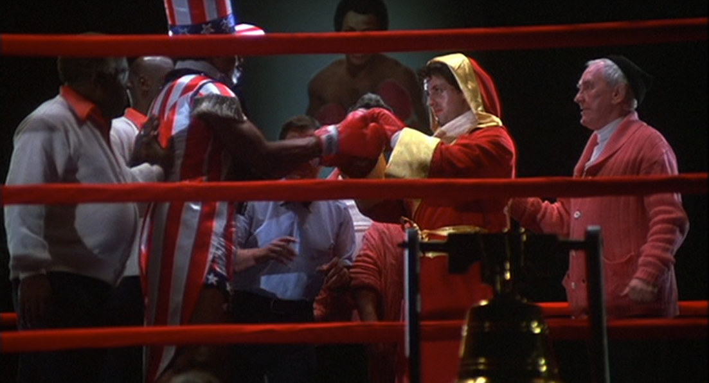
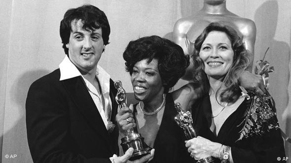
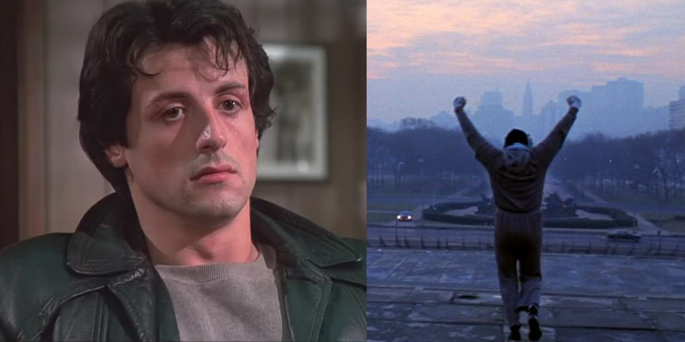

록키(Rocky, 1976)는 이태리계 이민의 후손 출신 청년 록키 발보아(Rocky Balboa)가 가난한 뒷골목 건달로부터 일약 권투 헤비급 세계 챔피언이 되어, 그것을 이어나가는 과정을 감동적으로 그린 대표적 복싱 영화. 

 

소위 '아메리칸 드림(American Dream)'이라는 것을 부활시키는 기폭제가 된 작품으로서, 부지런하고 성실하게 일하면 누구에게나 기회가 온다는 이 관념은 미국을 세계의 지도국으로 끌어올린 정신적 원천이기도 했으나, 60년대 학생 운동과 월남전 패배 등으로 이에 대한 회의적인 시각이 대두되어 왔었다.

 

이러한 생각에 정면으로 반기를 든 것이 <록키>였고, 다소 과장되고 작위적인 면은 있으나 의기소침해있던 미국인들에게 자신감을 다시 심어주는 작은 계기가 되었다. 또한 <록키> 시리즈는 실베스터 스탤론이라는 무명의 배우를 일약 세계적인 스타로 탄생시킴으로써, 이 영화가 말하고자 하는 '아메리칸 드림'을 그대로 실증해준 셈이 되었다. 실제로, 이 영화는 그가 직접 각본을 썼고 2편 이후부터는 감독까지 도맡았다. 

당시 무명이었던 배우 스탤론은 기회를 노리면서 32편의 각본까지 썼지만, 전부 제작자들에게 딱지를 맞았다. 그가 33번째의 각본을 쓸 때는 30살의 나이로, 아내는 임신 중이었고 수중에는 불과 106달러가 남아있을 뿐이었다. 

'록키'라고 이름붙인 이 대본은 명제작자팀 어윈 윈클러(Irwin Winkler) - 로버트 채토프(Robert Chartoff)의 눈에 띄었다. 그러나 그들은 영화화를 계획하면서 버트 레이놀즈나 로버트 레드포드를 주인공으로 쓰기를 원했으나 스탤론은 이를 단호히 거부했다. 주연은 자기여야 한다는 것이 그의 조건이었다. 무명의 신인에게 모험을 하고 싶지 않았던 제작자들은 그대신 조건을 걸었다. 제작비를 100만달러 이상 쓰지 않아야 한다는 것이었다. 이것은 보통 영화 1편의 빠듯한 제작비에 해당하는 것이었다. 

 

제작비를 줄일 수 있는 모든 방법이 강구되었다. 출연진이나 제작진들을 가능한한 개런티가 적게 드는 무명들로 구성하고, 필라델피아 현지 촬영과 LA에서의 스튜디오 촬영을 불과 28일만에 끝냈다. 100만 달러에 약간 미달한 제작비는 클라이맥스의 시합 장면에 집중 투입되었다.

개봉시의 반응은 엄청난 것이었다. 그해에 미국에서만 5,600만 달러가 넘는 수입을 올렸고, 세계적인 히트작이 되었다. 월남전과 워터게이트의 후유증, 세계적의 지도국으로서 자존심 상실 등으로 의기소침한 미국인들에게는 대중적인 영웅이 새롭게 필요한 시기였고 '록키'는 바로 그 전형이었던 것이다. 이러한 시대상은 그해 아카데미상 결과에서 그대로 드러나고 있다. 

 

76년은 문제 의식을 가진 비판적 작품들이 많았던 시기이다. <록키>와 함께 작품상 후보에 오른 것은 워터게이트 사건을 다룬 <모두가 대통령의 사람들>, TV 시청률 경쟁의 흑막을 파헤친 <네트워크>, 월남전 귀환 장병의 정신적 방황을 그린 칸느 그랑프리 작품 <택시 드라이버>, 반체제 저항 음악의 대표적 가수인 우디 거스리의 생애를 그린 <바운드 포 글로리>였다. 일상에서 이러한 문제들에 너무나 지친 미국인들은, 돈내고 보는 극장에서까지 더 이상 이런 골치거리들을 다시 보기를 원치 않았다. 

아카데미 작품, 감독, 각본, 남우주연(스탤론), 여우주연(샤이어), 남우조연(메레디스, 영 공동 후보), 녹음, 주제가, 편집상의 10개 부문 후보에 오른 <록키>는 작품, 감독, 편집상의 3개를 차지했다. 비록 수상은 못했지만, 출연료 한 푼 없이 수익의 10퍼센트라는 배짱 계약을 체결한 스탤론은 돈과 인기를 한꺼번에 차지한 스타가 되었다

출처: Films

